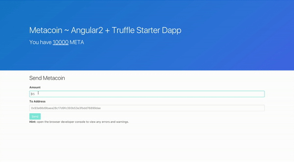

# Angular-Truffle

This project was generated with [Angular CLI](https://github.com/angular/angular-cli) version 1.0.0.

An angular4 + [truffle](https://github.com/trufflesuite/truffle) starter app. Write, compile & deploy smart contracts for Ethereum.

Featured on [State of the Dapps](https://dapps.ethercasts.com/dapp/angular2-truffle-starter-dapp)

## Demo
Create a coin with an initial supply and send an amount to your Ethereum wallet address

*Note: This demo was made at the time this project used Angular2. It has since upgraded to Angular4 and works the exact same way :)*

## How to use
There are 2 small parts to successfully running this project.

### Part 1

1. `git clone https://github.com/Nikhil22/angular4-truffle-starter-dapp.git`
2. `cd angular4-truffle-starter-dapp`
3. `npm install`

### Part 2
For the second part, be sure you're connected to an Ethereum client before running the commands below. If you're new, install [testrpc](https://github.com/ethereumjs/testrpc) to run a local blockchain RPC server. After that, simply run `testrpc` in a new tab.

And then in the original tab, run:

4. `truffle compile` to compile your contracts
5. `truffle migrate` to deploy those contracts to the network
6. `ng serve`. Navigate to `http://localhost:4200/`. The app will automatically reload if you change any of the source files.
7. Make sure there are no errors in browser console

## Code scaffolding

Run `ng generate component component-name` to generate a new component. You can also use `ng generate directive/pipe/service/class/module`.

## Build

Run `ng build` to build the project. The build artifacts will be stored in the `dist/` directory. Use the `-prod` flag for a production build.

## Running unit tests

1. Run `ng test` to execute the unit tests via [Karma](https://karma-runner.github.io).
2. Run `truffle test` to run tests associated with your solidity smart contracts. The test folder for this can be found in the `test` directory at the root level of this project

## Running end-to-end tests

Run `ng e2e` to execute the end-to-end tests via [Protractor](http://www.protractortest.org/).
Before running the tests make sure you are serving the app via `ng serve`.

## Contribute

Contributions are always welcome & encouraged! :smile: If you'd like to contribute, please see [Contributing Guidelines](CONTRIBUTE.md).

## Contributors
1. [Nikhil Bhaskar](https://github.com/Nikhil22)
2. [Chris Fraser](https://github.com/chrisfraser)

## Further help

To get more help on the Angular CLI use `ng help` or go check out the [Angular CLI README](https://github.com/angular/angular-cli/blob/master/README.md).

## Technologies & Languages Used
1. Angular4 (Typescript/Javascript)
2. Truffle (Solidity)
